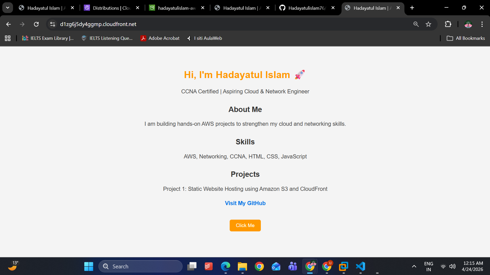
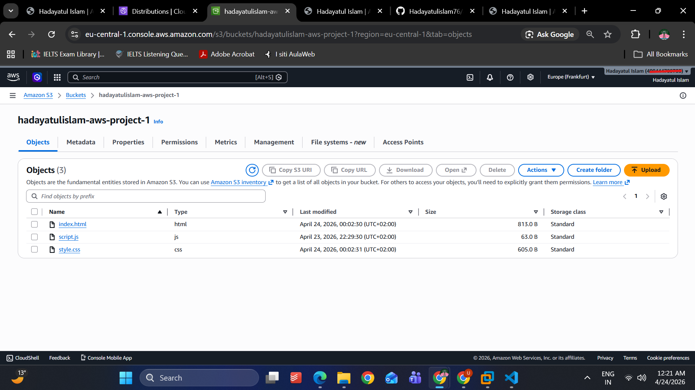
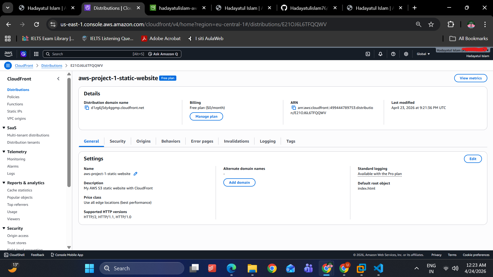

# AWS Project 1 - Static Website Hosting

This project demonstrates how to host a static website on AWS using Amazon S3 and deliver it securely using CloudFront.

---

## 🚀 What I Built
I created a simple static website using HTML, CSS, and JavaScript and deployed it on AWS.

The architecture is:

User → CloudFront (CDN + HTTPS) → S3 (Static Website)

---

## 📸 Screenshots

### Website

### S3 Bucket

### CloudFront Distribution

---

## 🌍 Live Demo
https://d1zg6j5dy4ggmp.cloudfront.net

---

## 🧰 AWS Services Used

### 1. Amazon S3
- Used to store static website files (HTML, CSS, JS)
- Enabled static website hosting

### 2. Amazon CloudFront
- Used as a Content Delivery Network (CDN)
- Enabled HTTPS for secure access
- Improved performance by caching content globally

---

## ⚙️ Steps I Performed

1. Created an S3 bucket
2. Uploaded website files (index.html, CSS, JS)
3. Enabled static website hosting
4. Configured bucket policy for public access
5. Created a CloudFront distribution
6. Connected CloudFront to S3
7. Enabled HTTPS (Redirect HTTP → HTTPS)
8. Used cache invalidation after updates

---

## 🔐 Key Features
- Static website hosting on AWS
- Secure HTTPS delivery
- Global content delivery (CDN)
- Simple interactive frontend

---

## 📚 What I Learned
- How S3 works for static hosting
- How CloudFront improves performance and security
- How HTTPS is implemented in AWS
- How caching and invalidation work
- Basic Git and GitHub usage

---

## 👨‍💻 Author
Hadayatul Islam  
CCNA Certified | Aspiring Cloud & Network Engineer
